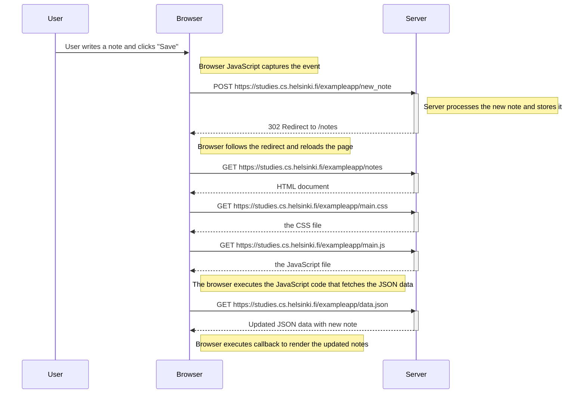

```mermaid
sequenceDiagram
    participant user as User
    participant browser as Browser
    participant server as Server

    user->>browser: User writes a note and clicks "Save"

    Note right of browser: Browser JavaScript captures the event

    browser->>server: POST https://studies.cs.helsinki.fi/exampleapp/new_note
    activate server
    Note right of server: Server processes the new note and stores it
    server-->>browser: 302 Redirect to /notes
    deactivate server

    Note right of browser: Browser follows the redirect and reloads the page

    browser->>server: GET https://studies.cs.helsinki.fi/exampleapp/notes
    activate server
    server-->>browser: HTML document
    deactivate server

    browser->>server: GET https://studies.cs.helsinki.fi/exampleapp/main.css
    activate server
    server-->>browser: the CSS file
    deactivate server

    browser->>server: GET https://studies.cs.helsinki.fi/exampleapp/main.js
    activate server
    server-->>browser: the JavaScript file
    deactivate server

    Note right of browser: The browser executes the JavaScript code that fetches the JSON data

    browser->>server: GET https://studies.cs.helsinki.fi/exampleapp/data.json
    activate server
    server-->>browser: Updated JSON data with new note
    deactivate server

    Note right of browser: Browser executes callback to render the updated notes
```
