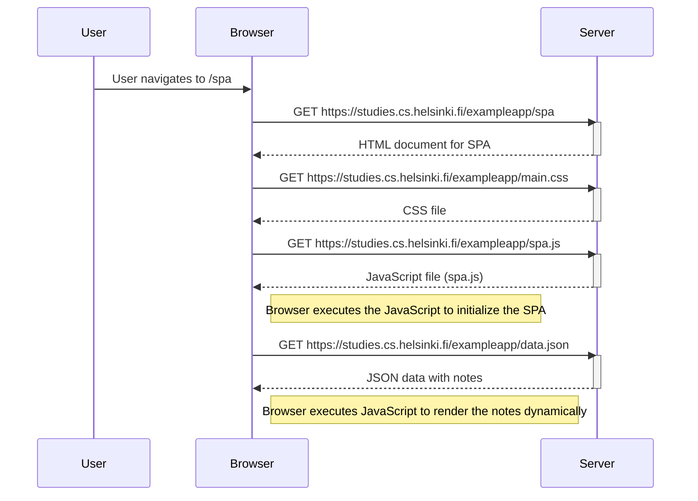

```mermaid
sequenceDiagram
    participant user as User
    participant browser as Browser
    participant server as Server

    user->>browser: User navigates to /spa

    browser->>server: GET https://studies.cs.helsinki.fi/exampleapp/spa
    activate server
    server-->>browser: HTML document for SPA
    deactivate server

    browser->>server: GET https://studies.cs.helsinki.fi/exampleapp/main.css
    activate server
    server-->>browser: CSS file
    deactivate server

    browser->>server: GET https://studies.cs.helsinki.fi/exampleapp/spa.js
    activate server
    server-->>browser: JavaScript file (spa.js)
    deactivate server

    Note right of browser: Browser executes the JavaScript to initialize the SPA

    browser->>server: GET https://studies.cs.helsinki.fi/exampleapp/data.json
    activate server
    server-->>browser: JSON data with notes
    deactivate server

    Note right of browser: Browser executes JavaScript to render the notes dynamically
```
