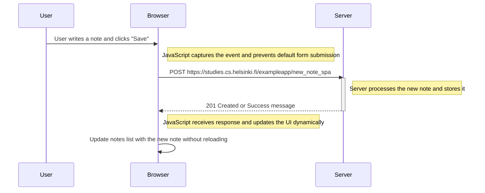

```mermaid
sequenceDiagram
    participant user as User
    participant browser as Browser
    participant server as Server

    user->>browser: User writes a note and clicks "Save"

    Note right of browser: JavaScript captures the event and prevents default form submission

    browser->>server: POST https://studies.cs.helsinki.fi/exampleapp/new_note_spa
    activate server
    Note right of server: Server processes the new note and stores it
    server-->>browser: 201 Created or Success message
    deactivate server

    Note right of browser: JavaScript receives response and updates the UI dynamically

    browser->>browser: Update notes list with the new note without reloading
```
